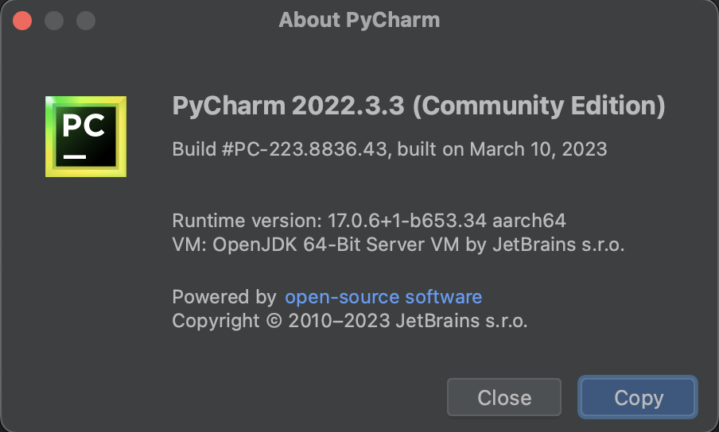
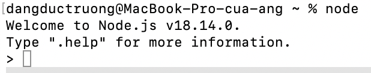
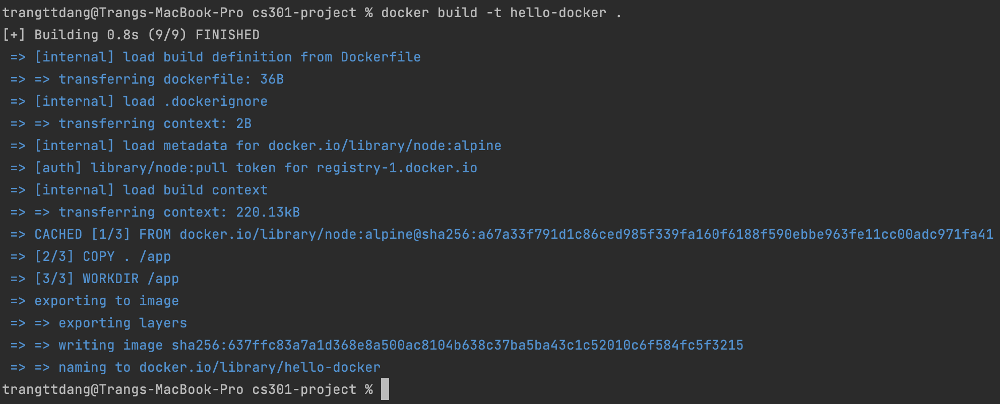
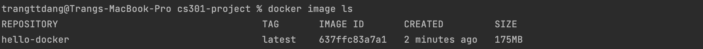
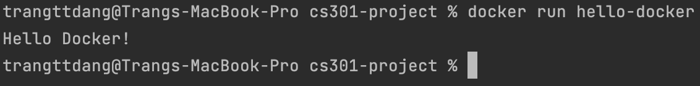
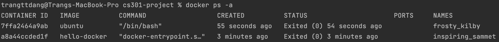
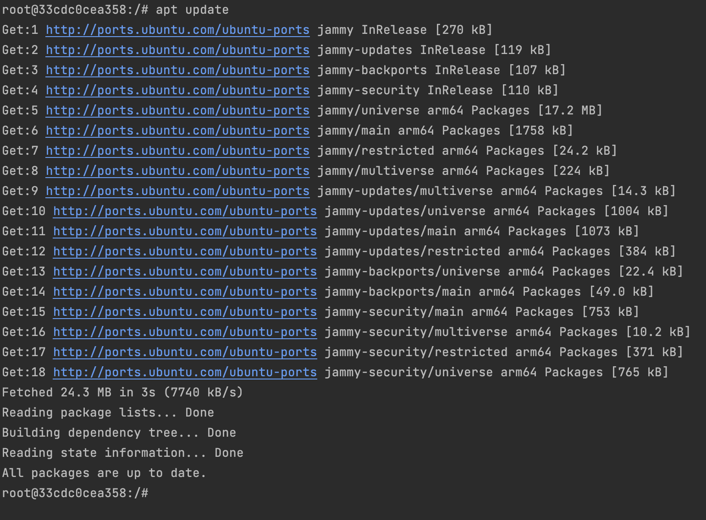
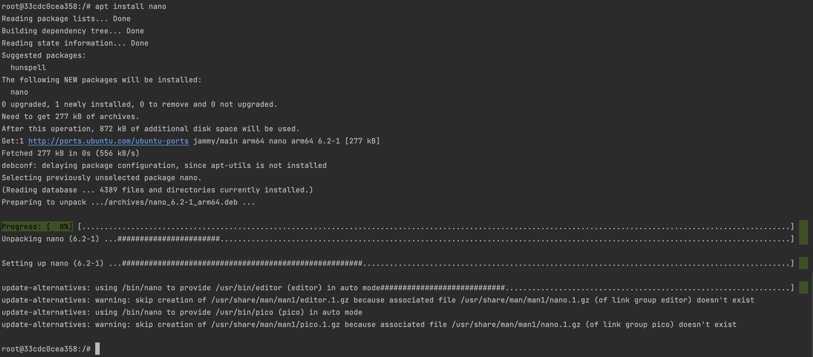
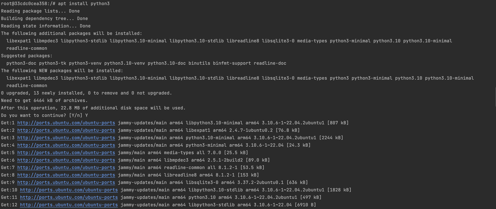
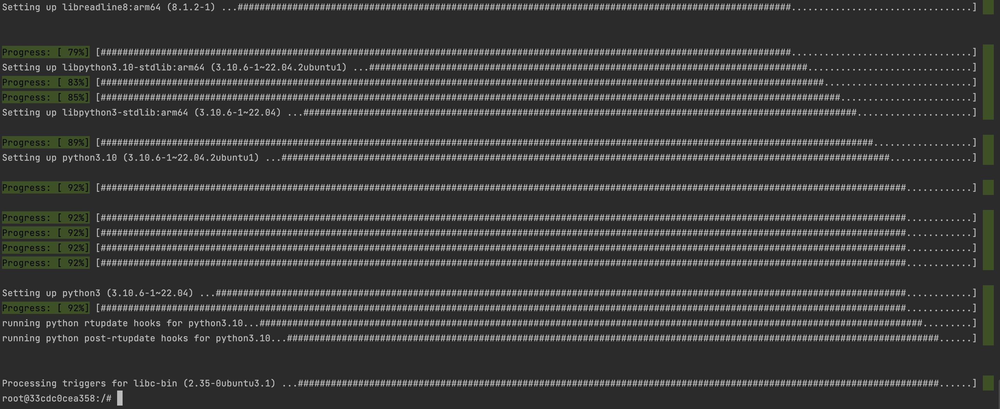

# Interpretable Gradient Boosting - Real Estate House Price Prediction

#### Name: Truong Dang
#### Email: tdd4@njit.edu
#### Course: CS 301-102
#### NJIT ID: 31558941

## Docker Installation
    I installed docker already. My docker version is **20.10.23**

## IDE
    I use both Pycharm and VS Code but for this Project, I prefer Pycharm. My Pycharm version is **Community 2022.3.3**

## Test Docker in Action

## Node Installation
    My node version is **18.14.0**

## Pack up application in Dockerfile

    docker build -t hello-docker .

    Below is the hello-docker image with the size of 175MB

    Run hello-docker by Docker

## Pull / Run Ubuntu

## Docker containers
    docker ps -a

## Run Docker terminal with Ubuntu
    docker run -t ubuntu

## Using apt
    Because I cound't install nano at first, I updated apt

    Install nano by apt

## Python3 Installation
    apt install python3

.

.

.
