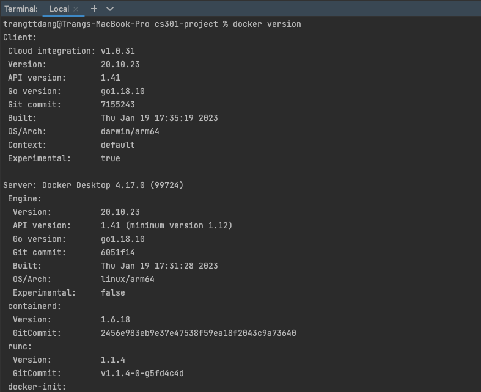
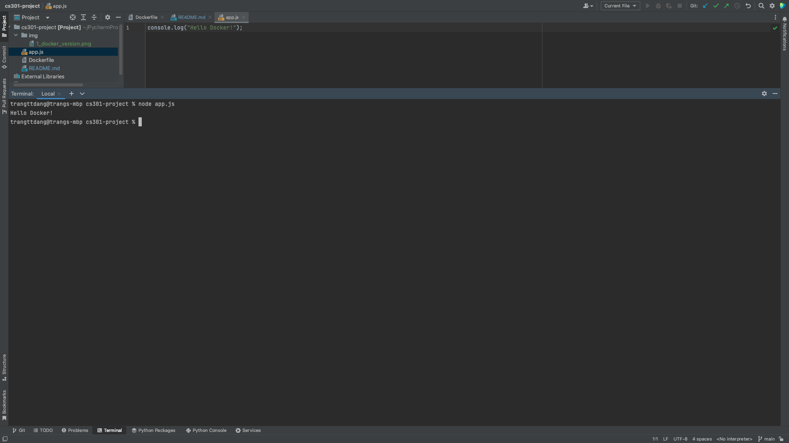
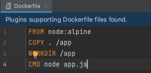

# Interpretable Gradient Boosting - Real Estate House Price Prediction

#### Name: Truong Dang
#### Email: tdd4@njit.edu
#### Course: CS 301-102
#### NJIT ID: 31558941

## Docker Installation
I installed docker already. My docker version is: 

## IDE
I use both Pycharm and VS Code but for this Project, I prefer Pycharm. My Pycharm version is: n

## Test Docker in Action

## Node Installation
My node version is

## Pack up application in Dockerfile

## Docker images

- Then I run the application by docker

## Pull and Run Ubuntu

## Install nana via package manager apt

## Run commands in a DOcker terminal

## Python3 Installation